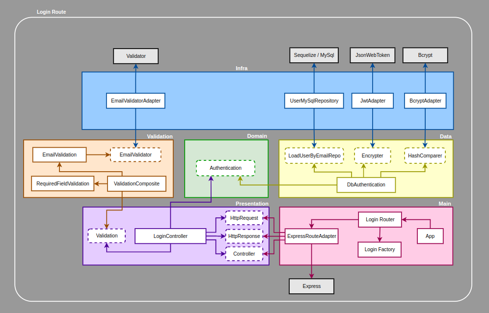
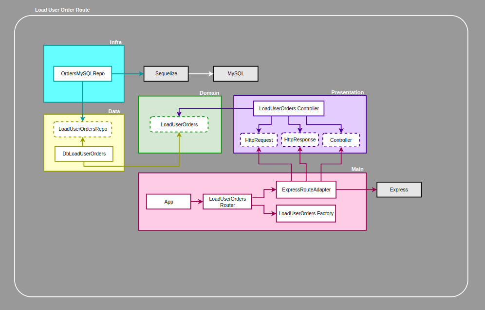
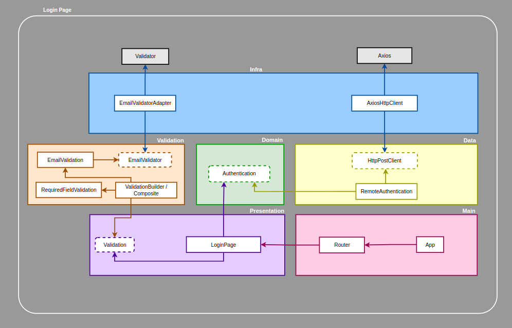
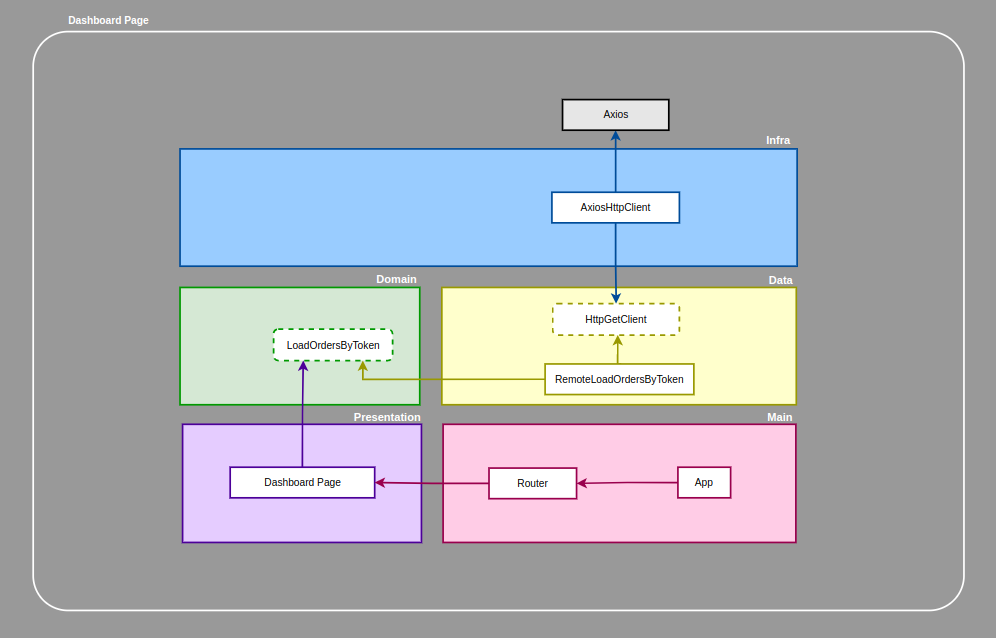

# Cash Force Project
Projeto realizado para o teste técnico da vaga Fullstack Node/Vue.js Developer - Júnior [Remoto, Brasil]
da empresa [Cash Force](https://cashforce.com.br/)

O projeto foi desenvolvido com Typescript, Node.Js, Docker e consiste em uma aplicação onde o usuário acessa através de uma area de login o dashboard do sistema para visualzação das ordens que possui e é composto por:

 - Uma API Rest utilizando express, sequelize com mysql como banco de dados, bcrypt
e jsonwebtoken.
 - Front-end utilizando Vue.Js 3, Vue Router 4, axios, express e webpack.

A estrutura do projeto foi desenhada seguindo os conceitos do Domain Driven Design (DDD)

A arquitetura está dividida em 5 camadas principais
- Domain
  - Onde ficam definidos os protocolos de casos de uso e modelos da aplicação.
- Data
  - Implementa os casos de uso definidos no Domain.
- Presentation
  - Camada que depende dos casos de uso definidos no Domain.
- Infra
  - Camada que faz o desacoplamento de bibliotecas externas do código da aplicação.
- Main
  - Camada de composição das instâncias necessárias para o funcionamento da rota.

> ## Backend
<details>
  <summary>
    <strong>Rota de Login</strong>
  </summary><br>
  Para essa rota foi adicionada a camada Validation para uma melhor organização do código. Pode ser considerada como parte da Presentation.

  
  Legenda:
  - Linhas tracejadas: Interfaces / Protocolos
  - Linhas sólidas: Classes

  <br>
</details>

<details>
  <summary>
    <strong>Rota de busca de notas por usuário</strong>
  </summary><br>

  
  Legenda:
  - Linhas tracejadas: Interfaces / Protocolos
  - Linhas sólidas: Classes

  <br>
</details>
<br>

> ## Frontend
<details>
  <summary>
    <strong>Login</strong>
  </summary><br>

  

  Legenda:
  - Linhas tracejadas: Interfaces / Protocolos
  - Linhas sólidas: Classes

  <br>
</details>

<details>
  <summary>
    <strong>Dashboard</strong>
  </summary><br>

  

  Legenda:
  - Linhas tracejadas: Interfaces / Protocolos
  - Linhas sólidas: Classes

  <br>
</details>
<br>

> ## Orientações para utilização
<details>
  <summary>
    <strong>Acessar via link</strong>
  </summary><br>

O projeto está disponível através do link [https://cashforceapi.renatolmendes.com](https://cashforce.renatolmendes.com)

<h3>Dados para login</h3>

- Usuário: allan@cashforce.com.br
- Senha: 123456

  <br>
</details>

<details>
  <summary>
    <strong>Rodar com docker</strong>
  </summary><br>

Para rodar o projeto via docker faça o clone do repositório em sua maquina:

  ```sh
  git clone git@github.com:natomendes/cash-force-project.git
  ```
Na raiz do projeto rode:

  ```sh
  npm install
  ```
Logo em seguida rode:

  ```sh
  npm run up
  ```
Aguarde a finalização do processo, dependendo da configuração da maquina após o termino dos processos do docker-compose que irá subir os containers para o banco de dados, o backend e o frontend, talvez seja necessário aguardar para que os servidores e o banco de dados estejam funcionais.

A aplicação estará disponivel na url [http://localhost:8080](http://localhost:8080)


<h3>Dados para login</h3>

- Usuário: allan@cashforce.com.br
- Senha: 123456

  <br>
</details>


<br>

### Desenvolvido por Renato Mendes ([Github](https://www.github.com/natomendes) - [Linkedin](https://www.linkedin.com/in/renatolmendes/))

